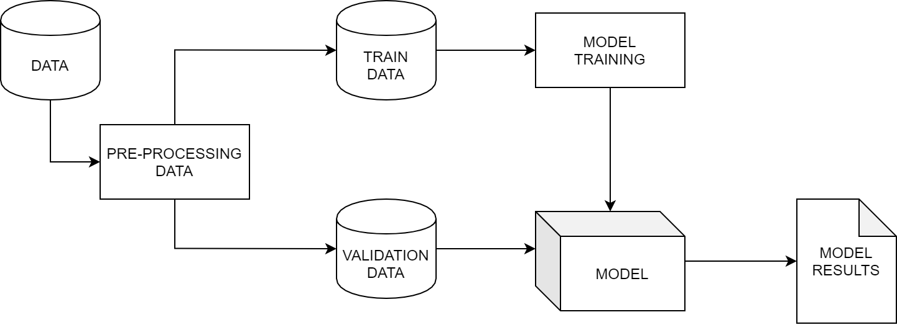
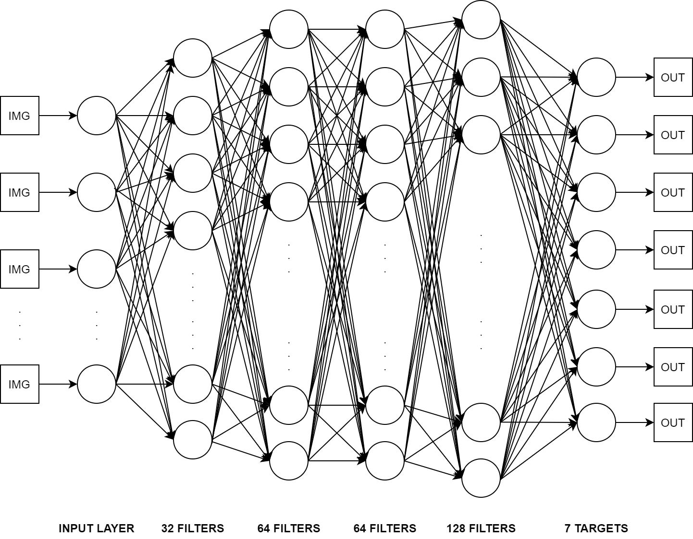

### Abstract
Este documento indaga en el ámbito del analisis y reconocimiento para expresiones faciales. En la primera sección se habla acerca de la generacion de
en la segunda sección se hablará especificamente de la propuesta metodólogica que es aplicada a PYFER, contemplando tanto arquitectura cómo modelo de ML empleado para la realización de la herramienta. Luego se tienen los resultados de los experimentos realizados, revelando un procentaje de precision del cincuenta por ciento lo cual no es óptimo pero es un baseline para seguir mejorando. Finalmente se dan a conocer las conclusiones respectivas del autor haciendo referencia a lo ya mencionado, preguntas abiertas, futuros análisis y el estado actual.

### Introducción    

### Propuesta metodológica
La propuesta para abordar el desarrollo de una herramienta que permita el reconocimiento de expresiones faciales y además ser capáz de determinar nuevas expresiones faciales dadas las expresiones básicas consta en:
1. generar un modelo de ML para el reconocimiento de las expresiones básicas
2. generar la lógica que permita determinar nuevas emociones

##### 1. Modelo de ML
Para generar este modelo hay que tener en consideracion varias cosas, como por ejemplo: la seleccion de un dataset ad hoc para el desarrollo, determinar la arquitectura que se usará, el tipo de red neuronal que se usará, definir el neuronal network model, entre otros. 

En este desarrollo se emplea la siguiente arquitectura

 
     

Con la figura anterior, se comienzan a definir cosas como, data, pre-processing data, train data, validation data, model training, model y model results.

Cabe destacar que la arquitectura definida es básica en una primera instancia pero no se descarta que pueda ser mejorada.

Cada uno de los puntos mencionados debe se llevado a cabo para generar este modelo de ML.

Data: Como dataset se hace uso del <b>cohn kanade</b> (CK+) dataset (https://www.pitt.edu/~emotion/ck-spread.htm)

pre-processing data: El pre procesamiento del CK+ dataset consiste en la carga de este y la adaptación necesaria para ser usada por la herramienta creada. Esta etapa genera dos datasets, TRAIN DATA y VALIDATION DATA.

TRAIN DATA: Este dataset es el responsable de que el modelo sea entrenado y sea capaz de que el modelo de ml reconozca expresiones faciales

VALIDATION DATA: este dataset es usado por el modelo para que este pueda validar el entrenamiento.

MODEL RESULTS: estos resutlados hacen referencia a la eficacia que posee el modelo de ml. Además, es en base a estos resultados que el modelo pueda ser mejorado o no y para ello se habrá que realizar un nuevo análisis para que este pueda ser mejorado.

MODEL: Para el modelo se emplea el uso de CNN's y para ello se define la siguiente estructura:

 
     

Donde la entrada serán imagenes del CK+ dataset y la salida será un puntaje por cada una de las siguietes emociones.

Emocion Descripcion
1       Enojo
2       Normal
3       Disgusto
4       Miedo
5       Felicidad
6       Tristesa
7       Impresión

Entre mayor sea el puntaje obtenido, la imágen que se clasifique tendrá una mayor probabilidad de ser dicha emoción. Es en base a esto que la lógica para determinar nuevas emociones puede ser realizada (quedando para una segunda versión).

El código fuente de la herramienta puede ser revisado en el repositorio de github https://github.com/nachobrb/pyfer/

### Resultados esperados}
[adjuntar resultados!!!]
En cuánto a lo que respecta a resultados, el modelo de ML dió en promedio una porcentaje de precision del 50% a la hora de clasificar expresiones faciales. Esto puede indicar que: 1. El modelo está mal implementado ó 2. El dataset no es el adecuado en cantidad/calidad.

Por lo tanto, queda para futuros experimentos aumentar el porcetaje de precision del modelo realizando los correspondientes analisis tanto para dataset y modelo como tal.

### conclusion
Proyectos en esta área no son sencillos, requieren de las habilidades necesarias para la abstracción y entendimiento de modelos de ML, sin embargo una vez ya que ya se tienen los conocimientos necesarios se puede volver un área fascinante. 
En cuanto al reconocimiento de expresiones faciales como tal, aún queda mucho por aprender. Hay muchas cosas que mejorar respecto del trabajo presente y como se mencionó en resultados esperados, se espera aumentar el porcentaje de precision en futuras aventuras en el mundo del reconocimineto de patrones, especificamente en patronces para el reconocimiento facial.

### referencias bibliográficas
